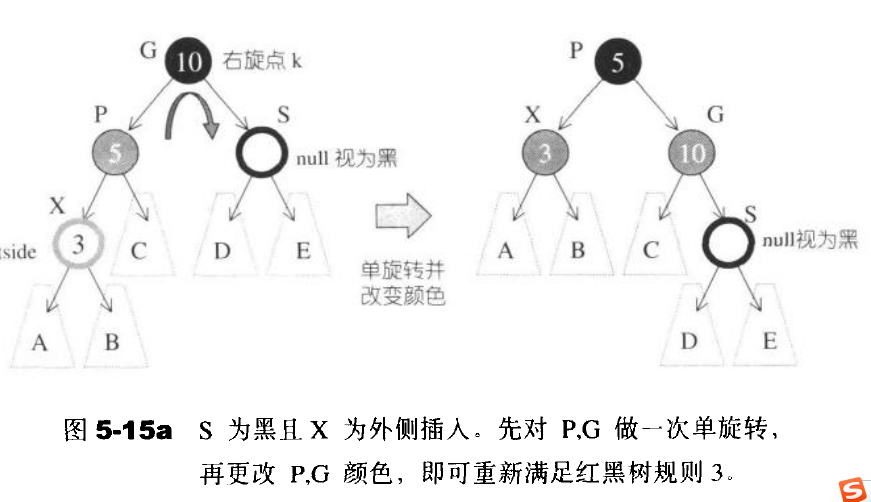
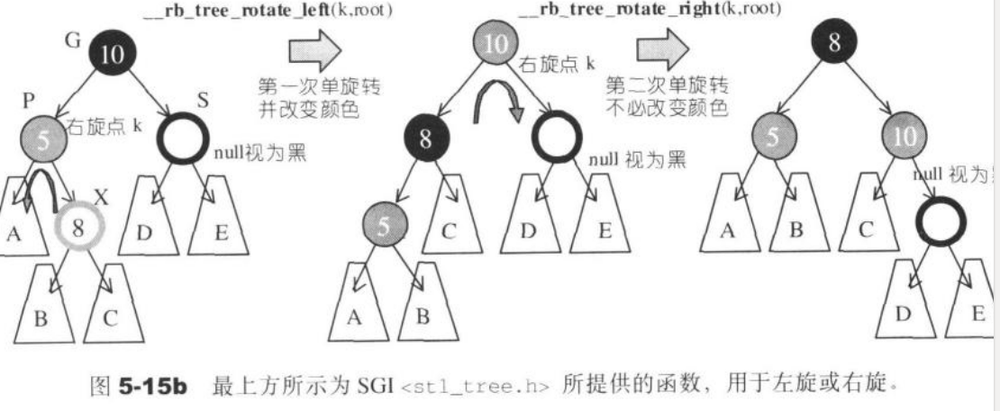
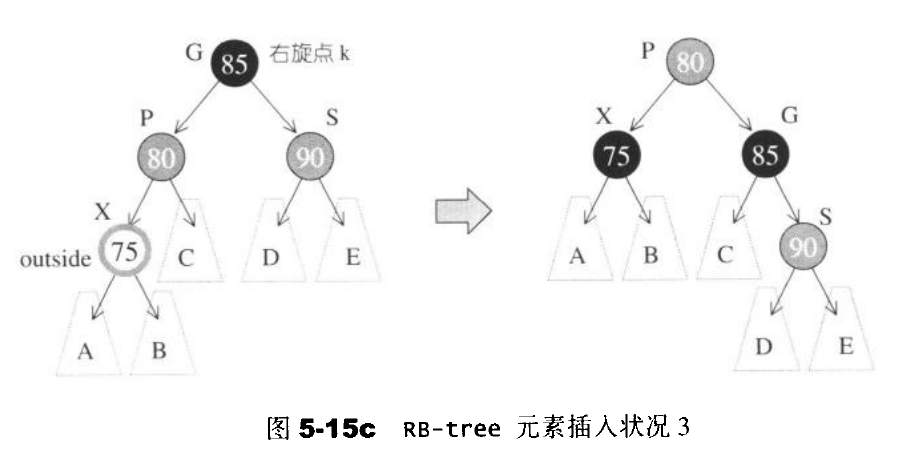
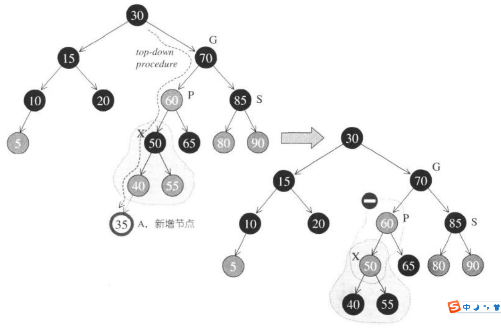

# 红黑树

#### 红黑树的四个规则：

* (1) 每个结点要么是红的，要么是黑的；
* (2) 根结点必须为黑的；
* (3) 若结点为红，它的子节点为黑；
* (4) 从根结点到 nil 结点之间的黑结点个数相同。

由于规则 (4) ，新插入的结点必须为红。

结点的数据结构：

```c++
class rbtree {
public:
    enum {RED, BLACK};
    struct node {
        int val;     // 插入值
        int color;   // 颜色
        node* left;  // 左子结点
        node* right; // 右子结点
        node(int v, int c = RED):val(v), color(c),
        left(nullptr), right(nullptr) { }
    };
};
```


#### 插入操作

我们从**普通的二叉搜索的插入操作**一步步进化成**真正的红黑树插入操作**：

(1) 我们先来看看普通的二叉搜索树是如何插入元素的：

```c++
class rbtree {
public:
	void insert(int val) {
    	root = insert(root, val);
    }
private:
    node* root;
    node* insert(node* root, int val) {
        if(root == nullptr)
            return new node(val);
        if(root->val < val)
            root->right = insert(root->right, val);
        if(root->val > val)
            root->left  = insert(root->left, val);
        return root;
    }
};
```

(2) 由规则 (2) ，我们必须把 root 结点改为黑色:

```c++
class rbtree {
public:
    void insert(int val) {
        root = insert(root, val);
        root->color = BLACK; // 规则(2)
    }
//...
};
```

(3) 插入结点时，如果它的**父节点为黑**，就**直接插入**，如果**父节点为红**，就需要**做旋转调整平衡**。

旋转分两种，一种是单旋，一种是双旋，和AVL树是一样的，只是要互换旋转结点的颜色。

单旋（右旋）如下：



P、G结点为需要旋转的结点，旋转后它们的颜色交换。这是为了保证规则 (3)、(4) 成立。

什么时候会发生单旋呢？

对于右旋，插入结点X**小于所在根结点G**的**左子结点P**的值，而且**左子结点P**和**它的左子结点X**的颜色都为**红色**。

对于左旋，插入结点**大于所在根结点**的**右子结点**的值，而且**右子结点**和**它的右子结点**的颜色都为**红色**。


为什么不直接判断左子节点P为红色就好了（因为新插入结点X一定为红色）？

这是考虑到其他情况——当 X 不是新插入结点的时候。下面会说到。


双旋 (先左再右) 如下：




什么时候发生双旋呢？

对于**先左再右**，插入结点 X 的值**大于所在根结点G**的**左子结点P**，且**左子结点P**和**它的右子结点X**的颜色均为**红色**。

对于**先右再左**，插入结点 X 的值**小于所在根结点**的**右子结点**，且**右子结点**和**它的左子结点**的颜色均为**红色**。

同样也考虑到其他情况 —— 当结点 X 不是新插入结点。下面会讲到。


接着，我就要添加这部分的代码了：

```c++
class rbtree {
// ...
private:
    node* root;
    node* insert(node* root, int val) {
        if(root == nullptr)
            return new node(val);
        
        if(root->val < val) {
            root->right = insert(root->right, val);
        	if(root->right->color == RED
                 && root->right->val < val
                 && root->right->right->color == RED) {
                // 左旋
            }
            if(root->right->color == RED
                 && root->right->val > val
                 && root->right->left->color == RED) {
                // 先右再左
            }

        }
        if(root->val > val) {
            root->left  = insert(root->left, val);
            if(root->left->color == RED
                 && root->left->val > val
                 && root->left->left->color == RED) {
                 // 右旋
            }
            if(root->left->color == RED
                 && root->left->val < val
                 && root->left->right->color == RED) {
                 // 先左再右
            }
        }
        return root;
    }
};
```


(4) 细心的你可能已注意到上面两种情况转换后的所在根结点 P 为**黑色**，如果转换后所在根结点 P 为**红色**呢？

看下图：



此时，如果P的父节点为黑色，那就没关系，而如果父节点为红色，就需要回溯到上层的根结点继续调整了。回溯操作就会使代码很复杂，所以有一种自顶向下的方法来将这种情况转为 (3) 中的两种情况：**沿着插入路径**，如果发现**某个结点为黑色而它的两个子结点均为红色**，则将该结点变为红色，它的两个子结点变为黑色：



此时，就可以发现结点P和结点X颜色都为红，它需要做右旋操作，**也就是上面坚持要检查结点 P 的左子结点为红色的原因**。


继续添加到代码中：

```c++
class rbtree {
// ...
private:
    node* root;
    node* insert(node* root, int val) {
        if(root == nullptr)
            return new node(val);
        
        // 先沿路径检查
        if(root->color == BLACK 
                && root->left && root->left->color == RED 
                && root->right && root->right->color == RED) {
            root->color = RED;
            root->left->color  = BLACK;
            root->right->color = BLACK;
        }
        //... 
    }
};
```


这就完成了插入操作了。代码位置